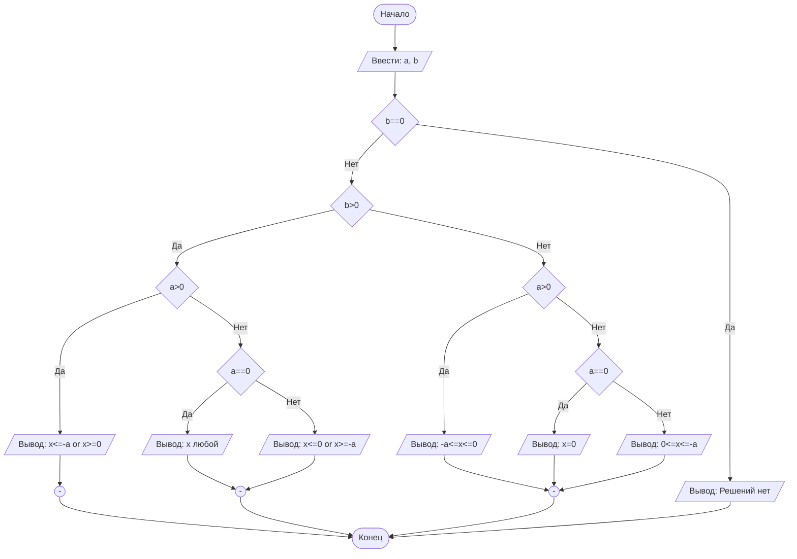

## Отчет по лабораторной работе № 1

#### № группы: `ПМ-2401`

#### Выполнил: `Силкин Семён Антонович`

#### Вариант: `26`

### Cодержание:

- [Постановка задачи](#1-постановка-задачи)
- [Входные и выходные данные](#2-входные-и-выходные-данные)
- [Выбор структуры данных](#3-выбор-структуры-данных)
- [Алгоритм](#4-алгоритм)
- [Программа](#5-программа)
- [Анализ правильности решения](#6-анализ-правильности-решения)

### 1. Постановка задачи

- Условия задачи

> Дано неравенство:
x · (x + a)/ b ≥ 0
> Где a и b — параметры (вводятся с клавиатуры). Решите его для x.
- Нам необходимо ввести с клавиатуры переменные, от которых будет зависеть решение нашего уравнения. Затем нужно решить его не забывая, что b не должно равняться нулю. В конце мы должны вывести все х при котором это неравенство верно. 

### 2. Входные и выходные данные

#### Данные на вход

- Так как в условии не указан тип вводимых переменных мы будем использовать переменные вещественного типа (double).
- Максимальное и минимальное значение этого типа данных это 1.7×10^308 и -1.7×10^308 соответственно, так как на этот тип отведено 8 байт памяти.

|   | Тип                 | min         | max        |
|---|---------------------|-------------|------------|
| a | Вещественное число  | -1.7*10^308 | 1.7*10^308 |
| b | Вещественное число  | -1.7*10^308 | 1.7*10^308 |

#### Данные на выход

- На выходе мы получим x, который будет вещественного типа и и будет иметь те же ограничения.

|   | Тип                 | min         | max        |
|---|---------------------|-------------|------------|
| x | Вещественное число  | -1.7*10^308 | 1.7*10^308 |

### 3. Выбор структуры данных

На вход программе подается 2 вещественных числа, которые будут храниться в переменной типа double

### 4. Алгоритм




### 5. Программа

```java
import java.io.PrintStream;
import java.util.Scanner;
public class Main {
  public static Scanner in = new Scanner(System.in);
  public static PrintStream out = System.out;
  public static void main(String[] args) {
    double a = in.nextDouble();
    double b = in.nextDouble();
    if (b == 0){
      out.println("Решений нет");
    }
    else if (b > 0){
      if(a > 0){
        out.print("x<=");
        out.print(-a);
        out.print(" or ");
        out.print("x>=0");
      }
      else if(a == 0){
        out.println("x - любой");
      }
      else{
        out.print("x<=0");
        out.print(" or ");
        out.print("x>=");
        out.print(-a);

      }
    }
    else {
      if (a > 0){
        out.print(-a);
        out.print("<=x<=0");
      }
      else if (a == 0){
        out.println("x=0");
      }
      else{
        out.print("0<=x<=");
        out.print(-a);
      }
    }
  }
}
```

### 6. Анализ правильности решения

Проверим все возможные сочетания вводимых переменных отталкиваясь от их знака.
1. Тест

- Input:
    ```
    1
    2
    ```

- Output:
    ```
    x<=-1.0 or x>=0
    ```

2. Тест

- Input:
    ```
    -1
    -2
    ```

- Output:
    ```
    0<=x<=1.0
    ```

3. Тест

- Input:
    ```
    -1
    1
    ```

- Output:
    ```
    x<=0 or x>=1.0
    ```
4. Тест

- Input:
    ```
    1
    -1
    ```

- Output:
    ```
    -1.0<=x<=0
    ```
5. Тест

- Input:
    ```
    1
    0
    ```

- Output:
    ```
    Решений нет
    ```
6. Тест

- Input:
    ```
    -1
    0
    ```

- Output:
    ```
    Решений нет
    ```
7. Тест

- Input:
    ```
    0
    0
    ```

- Output:
    ```
    Решений нет
    ```
8. Тест

- Input:
    ```
    0
    1
    ```

- Output:
    ```
    x - любой
    ```
9. Тест

- Input:
    ```
    0
    -1
    ```

- Output:
    ```
    x=0
    ```
